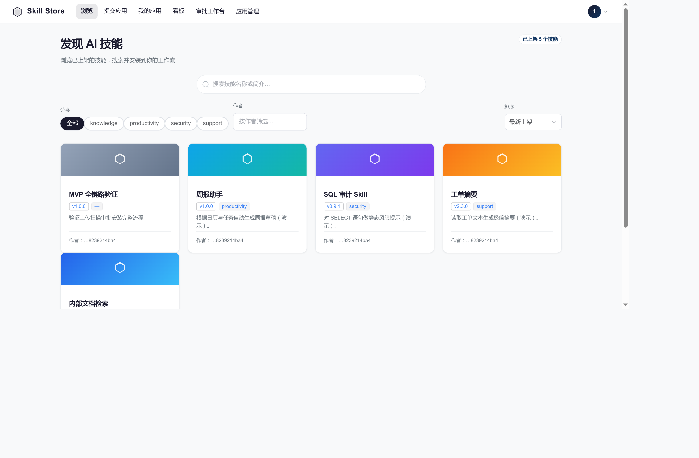
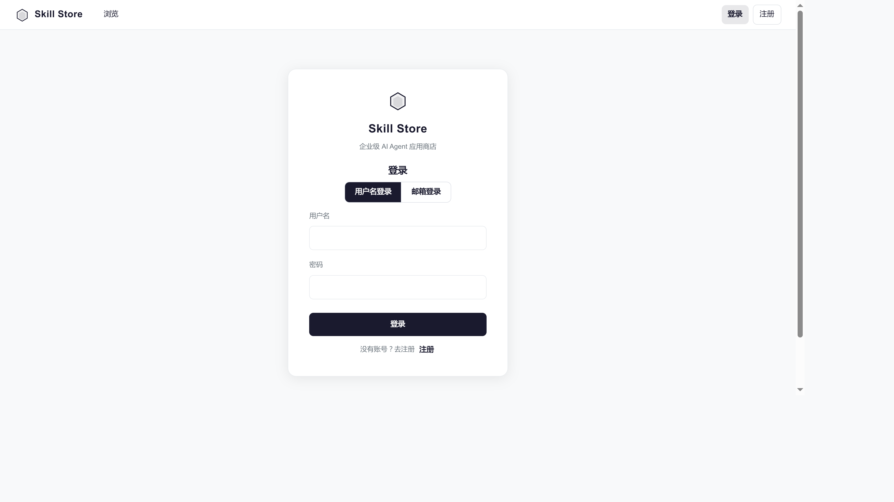
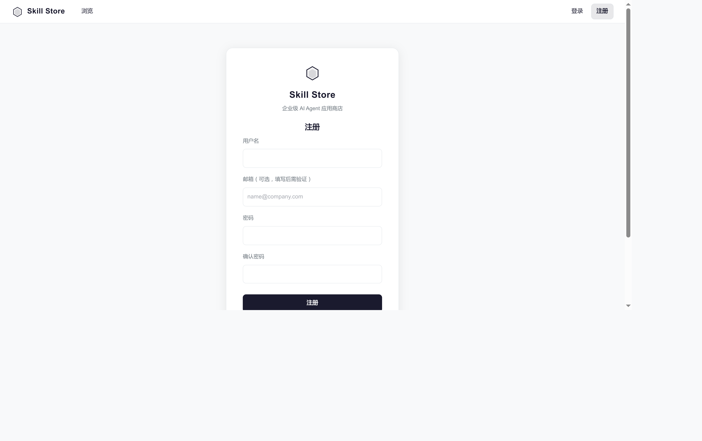
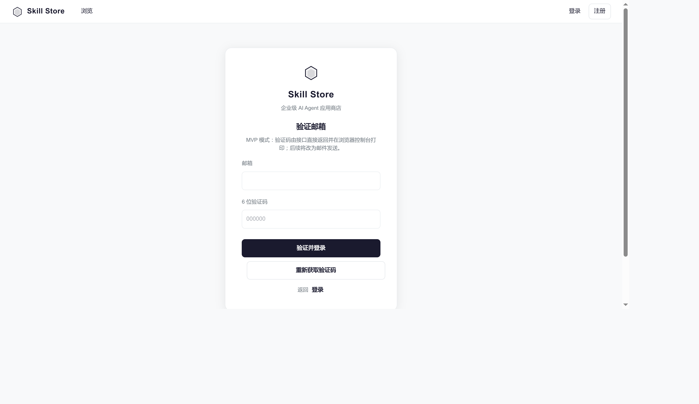
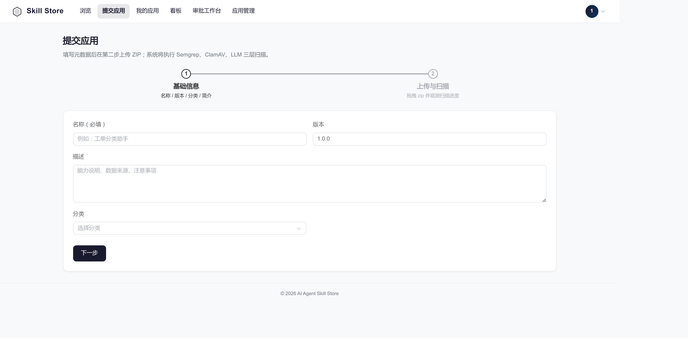
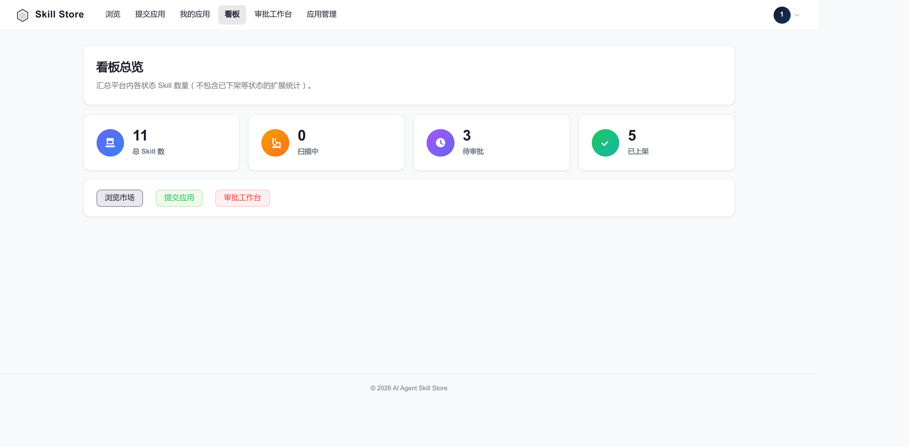
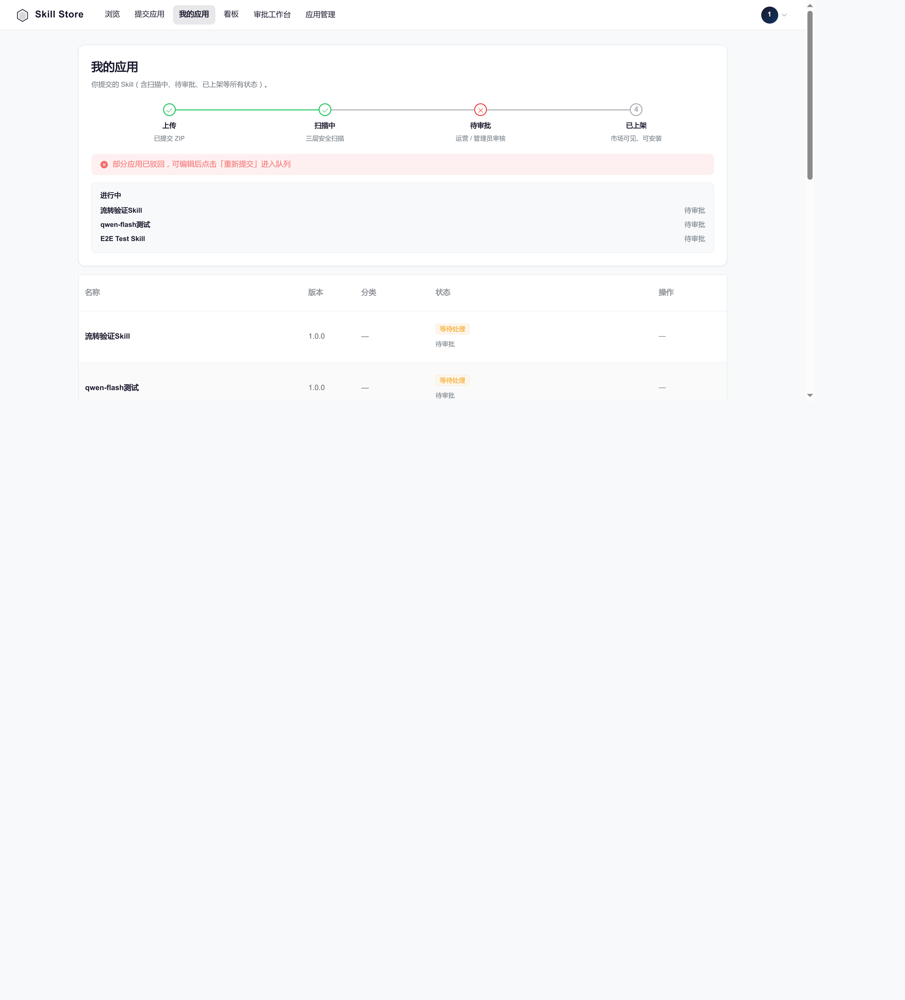
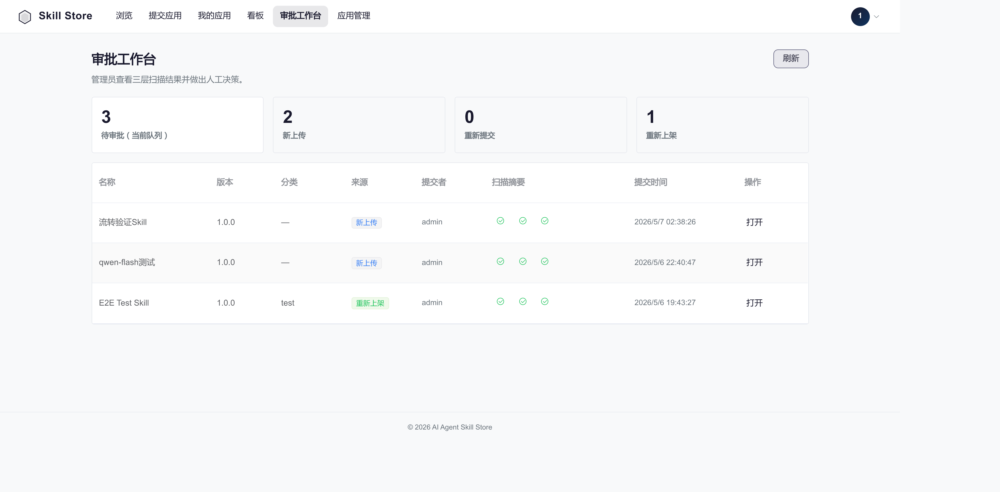
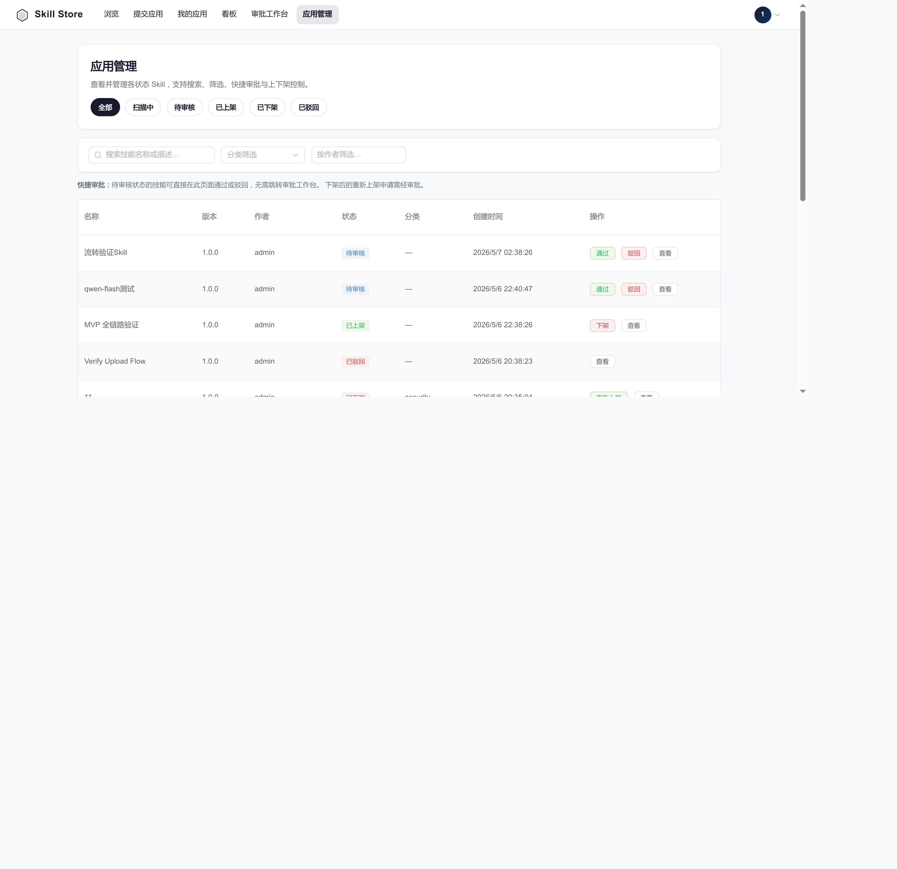
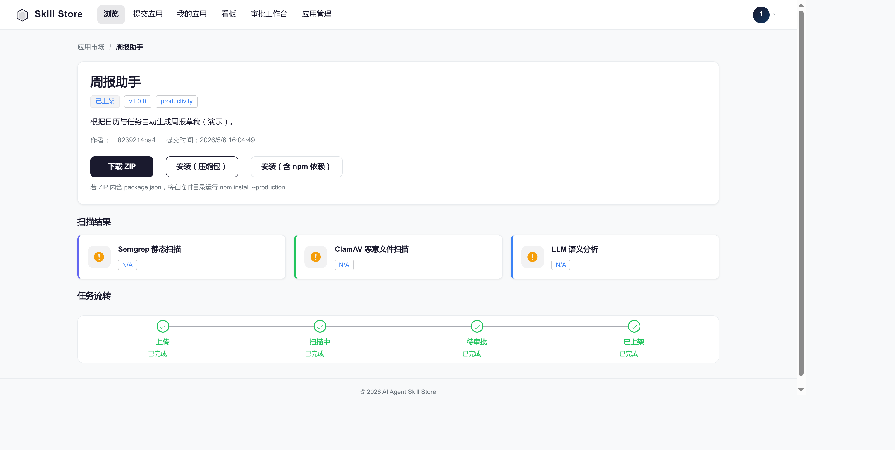

# 🏪 JSD SkillHub — 企业级 AI Agent 应用商店

> 面向企业内部的 AI Skill 统一管理平台。开发者提交 Skill 包，管理员审批上架，员工浏览、搜索、一键安装。

<p align="center">
  
</p>

---

## ✨ 功能特性

- **🔐 用户认证** — 用户名 + 邮箱双模式登录，邮箱验证码注册
- **🛒 应用市场** — 卡片式展示，动态分类、作者筛选、热门排序
- **📦 Skill 上传** — ZIP 包上传，自动触发三层安全扫描
- **🛡️ 三层安全扫描** — Semgrep 静态分析 + ClamAV 病毒扫描 + LLM 语义分析
- **✅ 审批工作台** — 管理员查看扫描结果，区分来源（新上传/重新提交/重新上架），一键审批
- **📊 看板 Dashboard** — KPI 统计：总数、扫描中、待审批、已上架
- **📋 我的应用** — 开发者查看所有提交的 Skill，驳回后可重新提交
- **⚙️ 管理员应用管理** — 搜索、分类筛选、作者筛选、下架/重新上架、快捷审批
- **⬇️ 下载与安装** — MinIO 预签名 URL 下载，一键安装到 OpenClaw
- **🔄 完整生命周期** — 上传 → 扫描 → 审批 → 上架 → 下架 → 重新上架

## 📸 页面预览

### 应用市场
浏览、搜索、分类筛选、作者筛选、热门排序
<p align="center">
  
</p>

### 登录 / 注册
用户名 + 邮箱双模式，邮箱验证码
<p align="center">
  &nbsp;&nbsp;
  
</p>

### 邮箱验证
<p align="center">
  
</p>

### 提交应用
两步流程：基础信息 → 上传 ZIP + 实时扫描进度
<p align="center">
  
</p>

### 看板 Dashboard
KPI 统计总览
<p align="center">
  
</p>

### 我的应用
开发者 Skill 管理，状态流程条，驳回后可重新提交
<p align="center">
  
</p>

### 审批工作台
三层扫描结果 + 来源区分（新上传/重新提交/重新上架）
<p align="center">
  
</p>

### 管理员应用管理
搜索 + 分类筛选 + 作者筛选 + 快捷审批
<p align="center">
  
</p>

### Skill 详情
扫描摘要 + 安装/下载 + 工作流可视化
<p align="center">
  
</p>

## 🏗️ 技术栈

| 层级 | 技术 |
|------|------|
| **前端** | Vue 3 + TypeScript + Element Plus + Vite |
| **后端** | FastAPI + SQLAlchemy (async) + Alembic |
| **数据库** | PostgreSQL 16 |
| **对象存储** | MinIO（Skill 包存储） |
| **安全扫描** | Semgrep + ClamAV + Qwen LLM |
| **容器化** | Docker + Docker Compose |

## 🚀 快速开始

### 前置要求

- Node.js ≥ 18
- Python ≥ 3.11
- Docker & Docker Compose
- MinIO（或 S3 兼容存储）

### 1. 启动基础设施

```bash
docker compose up -d postgres minio
```

### 2. 启动后端

```bash
cd backend
pip install -r requirements.txt
cp .env.example .env  # 编辑数据库和 MinIO 配置
alembic upgrade head
uvicorn app.main:app --host 0.0.0.0 --port 8000
```

### 3. 启动前端

```bash
cd frontend
npm install
npm run dev
```

访问 `http://localhost:5173` 即可使用。

默认管理员账号：`admin` / `admin123`

## 📁 项目结构

```
├── frontend/          # Vue 3 前端
│   └── src/
│       ├── api/       # API 调用层
│       ├── views/     # 页面组件
│       ├── stores/    # Pinia 状态管理
│       └── router/    # 路由配置
├── backend/           # FastAPI 后端
│   └── app/
│       ├── routers/   # API 路由
│       ├── models/    # SQLAlchemy 模型
│       ├── schemas/   # Pydantic schemas
│       ├── services/  # 业务逻辑
│       └── tasks/     # 异步任务（扫描）
├── skills/            # 默认 Skill 模板
│   ├── pm/            # 产品经理 Skill
│   ├── developer/     # 开发者 Skill
│   ├── tester/        # 测试 Skill
│   └── ui-design/     # UI 设计 Skill
├── core/              # 项目文档（MRD/PRD/TRD/RFC）
├── screenshots/       # 页面截图
└── docker-compose.yml
```

## 🤝 贡献

1. Fork 本仓库
2. 创建特性分支 (`git checkout -b feature/amazing-feature`)
3. 提交改动 (`git commit -m 'Add some amazing feature'`)
4. 推送到分支 (`git push origin feature/amazing-feature`)
5. 创建 Pull Request

## 📄 许可证

[MIT](LICENSE)

---

<p align="center">
  Built with ❤️ by <a href="https://github.com/wzzfather">wzzfather</a>
</p>
