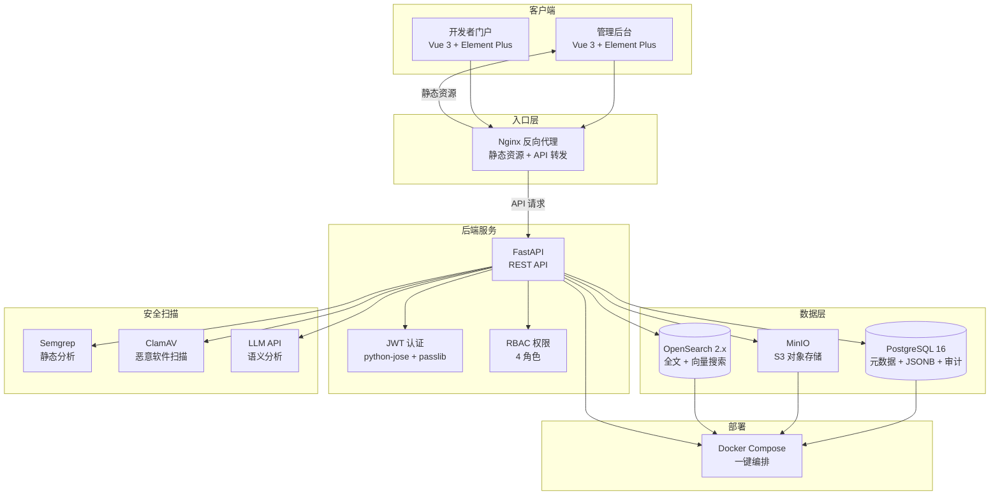

# 企业级 AI Agent 应用商店 — 技术选型说明书

**文档版本**：v2.0（2026-05-06 更新，对齐锁定技术栈）  
**适用场景**：5～10 人团队、私有化/混合云、需满足注册发现、安全治理与生态运营的企业级交付。  
**状态**：技术栈已锁定，不得自行变更。

---

## 0. 选型变更记录

| 版本 | 日期 | 变更内容 |
|------|------|---------|
| v1.0 | 2026-05-03 | 初始选型（Next.js + Temporal + MongoDB + Kafka + Keycloak + K8s） |
| v2.0 | 2026-05-06 | 精简技术栈：Next.js→Vue3, Keycloak→JWT, Temporal→状态机, Kafka→asyncio, MongoDB→PG JSONB, K8s→Docker Compose |

**变更原因**：
- MVP 阶段不需要 K8s 全套编排，Docker Compose 足够且大幅降低运维复杂度
- Keycloak 对于 5-10 人团队过重，JWT + 简单 RBAC 表满足初期需求
- Temporal 工作流引擎学习曲线陡峭，审批流程用数据库状态机实现更直观
- 前后端统一 Vue3+FastAPI，降低技术栈扩散风险
- 去掉 MongoDB，用 PostgreSQL JSONB 存扫描结果，减少运维组件数

---

## 1. 锁定技术栈总览

| 层 | 技术 | 版本 | 用途 |
|----|------|------|------|
| 前端 | **Vue 3** + Vite + Element Plus + Pinia + TypeScript | Vue 3.4+ | 管理后台 + 开发者门户 |
| 后端 | **FastAPI** + SQLAlchemy (async) + Pydantic | Python 3.11+ | REST API 服务 |
| 数据库 | **PostgreSQL** 16 | 16 | 元数据 + 扫描结果(JSONB) + 审计日志 |
| 对象存储 | **MinIO** | 最新 | 应用包存储（S3 兼容） |
| 搜索引擎 | **OpenSearch** 2.x | 2.x | 全文检索 + 向量语义搜索 |
| 认证授权 | **JWT** (python-jose + passlib) | - | 用户认证 + RBAC 权限控制 |
| 容器化 | **Docker** + Docker Compose | - | 本地开发 + 生产部署 |
| 数据库迁移 | **Alembic** | - | 数据库 schema 版本管理 |

**硬约束：前端不用 Next.js/React，后端不用 Spring/Java。**

---

## 2. 逐项选型原因

### 2.1 前端：Vue 3 + Element Plus

**为什么选 Vue 3？**
1. **学习曲线低**：模板语法直观，新手（实习生）上手快，比 React hooks 概念负担轻
2. **Element Plus 生态成熟**：企业级中后台组件库，表格/表单/弹窗/分页等开箱即用，减少 50%+ UI 工作量
3. **国内团队主流**：中文文档完善，社区活跃，招人容易，排障资源丰富
4. **TypeScript 一等支持**：`<script setup>` + TS 组合式 API，类型安全
5. **Vite 构建极快**：HMR 毫秒级，开发体验好

**为什么不用 Next.js/React？**
- Next.js 的 SSR/SSG 能力对本项目（内部管理系统）价值不大，多出来的复杂度是负担
- React 需要额外的状态管理方案（Redux/Zustand），Vue 3 的 Pinia 内置且更简洁
- 团队技术栈偏 Python，Vue 的模板语法比 JSX 更容易跨角色理解

**Element Plus vs Ant Design Vue vs Arco Design**
- Element Plus：组件最全、文档最好、社区最大 → **选定**
- Arco Design：字节出品，设计感好但组件数量略少
- Ant Design Vue：蚂蚁金服系，也不错但 Vue 3 适配稍晚于 Element Plus

### 2.2 后端：FastAPI

**为什么选 FastAPI？**
1. **异步原生**：async/await 一等支持，天然适合 IO 密集型（文件上传、搜索调用、扫描集成）
2. **自动文档**：Pydantic 模型自动生成 Swagger/OpenAPI 文档，前后端对接零成本
3. **类型安全**：请求/响应自动校验，参数错误自动返回 422 + 详细错误信息
4. **Python 生态**：与安全扫描工具（Semgrep/ClamAV）、LLM API、数据分析库天然互通
5. **开发效率**：代码量少，原型快，5-10 人团队产出高

**为什么不用 Spring Boot？**
- Java 生态强但启动慢、代码量大，对中小团队开发效率偏低
- 安全扫描工具（Semgrep/ClamAV）Python 集成更方便
- Python 与 AI/ML 生态互通，后续扩展 LLM 功能无缝衔接

**为什么不用 NestJS？**
- Node.js 后端也不错，但团队主语言是 Python，减少跨语言成本

### 2.3 数据库：PostgreSQL 16

**为什么选 PostgreSQL？**
1. **事务完整**：ACID 保证，适合应用元数据、权限、审计等强一致性数据
2. **JSONB 类型**：扫描结果（Semgrep/ClamAV/LLM 输出）是嵌套 JSON，PG JSONB 支持查询和索引
3. **扩展性强**：pgvector（向量搜索）、全文检索、范围类型等
4. **运维成熟**：备份、复制、监控工具链完善
5. **免费开源**：PostgreSQL License，无商业版费用

**为什么不用 MongoDB？**
- 去掉 MongoDB 减少一个组件，降低运维负担
- 扫描结果用 PG JSONB 存储足够，不需要独立的文档数据库
- MVP 阶段数据量不大，单 PG 实例完全够用

**为什么不用 MySQL？**
- JSONB 支持不如 PG 灵活（MySQL JSON 性能和查询能力偏弱）
- PG 在复杂查询、窗口函数、CTE 等方面更强

### 2.4 搜索引擎：OpenSearch 2.x

**为什么选 OpenSearch？**
1. **全文 + 向量一体化**：一个集群同时支持关键词搜索和向量语义搜索（kNN）
2. **权限过滤**：DSL 支持 per-document 权限查询，不同角色只搜到自己有权限的应用
3. **中文分词**：IK Analysis 插件支持中文分词
4. **Apache 2.0 许可**：无 SSPL 限制（Elasticsearch 7.11+ 改为 SSPL/ELv2）
5. **Docker 部署简单**：单节点 `discovery.type=single-node` 即可启动

**为什么不用 Elasticsearch？**
- 许可证变更（SSPL），商业使用有合规风险
- 功能等价，OpenSearch 是 ES 7.10 的开源 fork

**为什么不用 Meilisearch？**
- 向量搜索支持有限，需要额外集成向量数据库
- 不如 OpenSearch 的 DSL 灵活（复杂筛选/聚合）

### 2.5 对象存储：MinIO

**为什么选 MinIO？**
1. **S3 API 兼容**：代码里用 S3 SDK，随时可切换到 AWS S3/阿里 OSS
2. **私有化部署**：企业内部部署，数据不出域
3. **预签名 URL**：前端直接下载，不经后端转发，减少带宽压力
4. **Docker 部署简单**：一个容器搞定，`server /data --console-address ":9001"`
5. **管理控制台**：9001 端口自带 Web UI，方便查看文件和 bucket

**为什么不用直接存本地文件系统？**
- 无法水平扩展、没有版本管理、无法生成临时下载链接
- MinIO 增加的复杂度很小（一个 Docker 容器），但带来的能力提升巨大

### 2.6 认证授权：JWT + RBAC

**为什么选 JWT 而不是 Keycloak？**
1. **轻量**：Keycloak 需要 JVM + 数据库 + 独立服务，JWT 只需两个 Python 库
2. **够用**：初期只需 4 个角色（admin/reviewer/developer/viewer），不需要 Keycloak 的完整 IdP 能力
3. **学习成本低**：python-jose 签发 + passlib 验证，几行代码搞定
4. **无状态**：Token 自包含用户信息，不需要每次请求查数据库验证

**角色设计**：
| 角色 | 权限 |
|------|------|
| admin | 所有权限（用户管理、系统设置、审批、应用管理） |
| reviewer | 审批管理（查看待审批列表、通过/驳回） |
| developer | 应用管理（创建、编辑、上传、提交审核） |
| viewer | 只读（搜索、查看已上架应用） |

**后续扩展路径**：如果需要 LDAP/AD 集成、SSO、多租户等，再引入 Keycloak。届时 JWT 方案无需大改，只需把签发逻辑从本地改为对接 Keycloak。

### 2.7 容器化：Docker + Docker Compose

**为什么选 Docker Compose 而不是 Kubernetes？**
1. **MVP 不需要 K8s**：单机部署足够，K8s 的编排/调度/自愈能力在初期是过度工程
2. **开发体验好**：`docker compose up` 一键启动所有依赖（PG/MinIO/OpenSearch），新人 5 分钟搭好环境
3. **运维简单**：5-10 人团队不需要专门的 K8s 运维人员
4. **够用**：Docker Compose 支持服务编排、健康检查、日志、网络隔离、数据卷持久化

**后续扩展路径**：
- Docker Compose → 单机生产部署（加 nginx 反向代理、健康检查、自动重启）
- 需要多实例/灰度发布时 → 迁移到 K8s（Dockerfile 不需要改，只需加 Helm Chart）

### 2.8 数据库迁移：Alembic

**为什么选 Alembic？**
1. **SQLAlchemy 官方迁移工具**：与 ORM 模型无缝集成
2. **自动生成迁移**：`alembic revision --autogenerate` 对比模型差异自动生成 SQL
3. **版本管理**：每个迁移有版本号，支持 upgrade/downgrade
4. **团队协作**：迁移文件提交 Git，团队成员 pull 后执行 `alembic upgrade head` 同步 schema

---

## 3. 被精简的组件（v1.0 → v2.0）

| 原组件 | 替代方案 | 精简原因 |
|--------|---------|---------|
| Next.js | Vue 3 + Vite | 内部管理系统不需要 SSR |
| MongoDB | PostgreSQL JSONB | 减少组件，扫描结果用 JSONB 足够 |
| Keycloak | JWT + RBAC 表 | 初期不需要完整 IdP |
| Temporal | 数据库状态机 | 审批流程简单，不需要工作流引擎 |
| Kafka | Python asyncio | 初期异步量不大，不需要消息队列 |
| K8s + Helm | Docker Compose | MVP 单机部署足够 |
| Prometheus + Grafana + Loki | 延后实现 | MVP 阶段优先功能，监控后续补 |

**后续需要时再逐个引入，遵循「够用即可、按需扩展」原则。**

---

## 4. 技术架构总览图

---

## 5. 技术栈锁定规则

> **以下规则写入 `.cursor/rules/project-overview.mdc`，Cursor 每次必读。**

1. **技术栈一经锁定，Cursor 和 OpenClaw 均不得自行变更**
2. 如需变更，必须由魏子政确认 → OpenClaw 评估影响 → 更新本文档 → 更新 Cursor rules
3. 新增依赖（npm/pip 包）允许，但不得引入新的框架/数据库/中间件
4. 所有变更必须记录在本文档的「变更记录」中

---

> 📅 创建日期：2026-05-03  
> 📅 更新日期：2026-05-06  
> 📌 配套文档：AGENT-ARCHITECTURE.md、CLAUDE.md、database/SCHEMA.md
